# изменение остаётся, вставка откатывается
```sql
--  увеличиваем capacity, но откатываем фан-шоп после проверки
BEGIN;
```
## До того как увеличили capacity
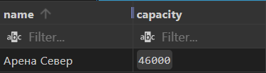
```sql
    -- Обновляем стадион «Арена Север» и оставляем значение в транзакции
    UPDATE football_club.stadiums
    SET capacity = capacity + 500
    WHERE name = 'Арена Север';

```
## После того как увеличили capacity
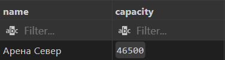
```sql
    -- Сохраняем точку перед потенциально рискованной вставкой
    SAVEPOINT sp_insert_shop;

```
## Фан шопы клуба до изменений
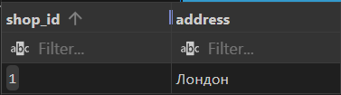
```sql
    --Пробуем создать ещё один фан-шоп клуба
    INSERT INTO football_club.fun_shop (address, club_id)
    SELECT 'Москва', fc.club_id
    FROM football_club.football_clubs fc
    WHERE fc.name = 'Челси';

```
## Фан шопы клуба после изменений

```sql
    -- Бизнес-логика не прошла, откатываемся
    ROLLBACK TO sp_insert_shop;
```
## Capacity после отката
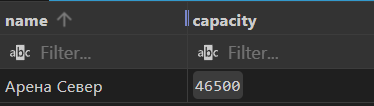
## фан щопы после отката
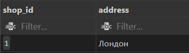
```sql


COMMIT; -- увеличение capacity сохраняется

```
**Результат:** вместимость Арена Север выросла, запись о магазине откатили .

##две точки сохранения и поэтапный откат
```sql
   --две точки сохранения и поэтапный откат
BEGIN;
```
## До всех изменений
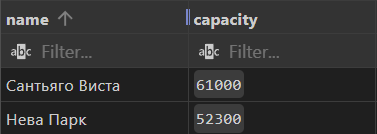
```sql

    --  фиксируем первую точку
    SAVEPOINT sp_before_1;

    --  Увеличиваем Нева Парк
    UPDATE football_club.stadiums
    SET capacity = capacity + 100
    WHERE name = 'Нева Парк';

```
## После увелечения первого
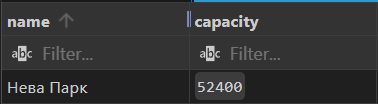
```sql
    --  фиксируем вторую точку
    SAVEPOINT sp_before_2;

    --  Увеличиваем Сантьяго Виста
    UPDATE football_club.stadiums
    SET capacity = capacity + 200
    WHERE name = 'Сантьяго Виста';
```
## После увелечения второго
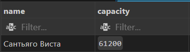
```sql
    -- Откатываемся к sp_before_2 
    ROLLBACK TO sp_before_2;

```
## После отката второго
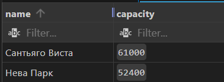
```sql
    --  Откатываемся к sp_before_1 
    ROLLBACK TO sp_before_1; 
```
## После отката первого
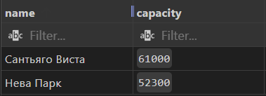
```sql
COMMIT; -- финально изменений нет

```
# Если первым rollback вызвать sp_before_1, то никаких изменений не будет, но если после него еще вызвать sp_before_2 выйдет ошибка
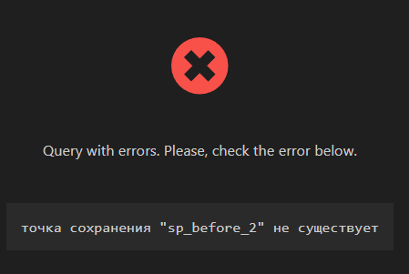
**Результат:** оба изменения отменены
