```sql
-- 1 : При вставке игрока, если nationality не задана, записывает Unknown
CREATE OR REPLACE FUNCTION football_club.trg_set_default_nationality()
RETURNS TRIGGER AS $$
BEGIN
  IF NEW.nationality IS NULL THEN
    NEW.nationality := 'Unknown';
  END IF;

  RETURN NEW;
END;
$$ LANGUAGE plpgsql;
CREATE TRIGGER trg_players_set_default_nationality
BEFORE INSERT ON football_club.players
FOR EACH ROW
EXECUTE FUNCTION football_club.trg_set_default_nationality();

INSERT INTO football_club.players(first_name, date_of_birth, nationality, position, market_value, club_id)
VALUES ('TriggerTest', '2000-01-01', NULL, 'Midfielder', 1000000, 1);


```
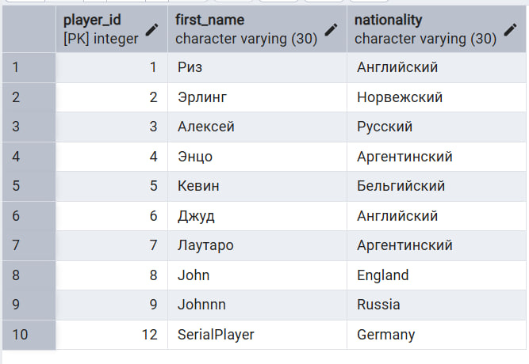
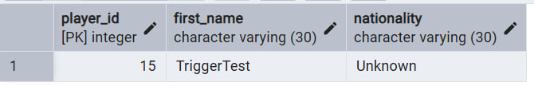


```sql
-- 2 : При вставке игрока, если стомость не задана, записывает 0
CREATE OR REPLACE FUNCTION football_club.trg_set_default_market_value()
RETURNS TRIGGER AS $$
BEGIN
  IF NEW.market_value IS NULL THEN
    NEW.market_value := 0::money;
  END IF;

  RETURN NEW;
END;
$$ LANGUAGE plpgsql;
CREATE TRIGGER trg_players_set_default_market_value
BEFORE INSERT ON football_club.players
FOR EACH ROW
EXECUTE FUNCTION football_club.trg_set_default_market_value();

INSERT INTO football_club.players(first_name, date_of_birth, nationality, position, market_value, club_id)
VALUES ('TriggerTest2', '2000-01-01', 'Russia', 'Midfielder', NULL, 1);
```
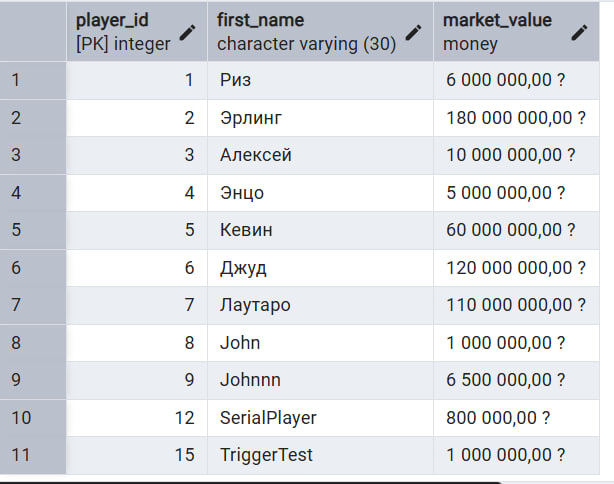


```sql
-- 1 : После удаления строки из football_club.players триггер срабатывает
CREATE OR REPLACE FUNCTION football_club.trg_notice_deleted_player()
RETURNS TRIGGER AS $$
BEGIN
  RAISE NOTICE 'Deleted player with id=%, name=%',
               OLD.player_id, OLD.first_name; 
  RETURN OLD; 
END;
$$ LANGUAGE plpgsql;
CREATE TRIGGER trg_players_notice_delete
AFTER DELETE ON football_club.players
FOR EACH ROW
EXECUTE FUNCTION football_club.trg_notice_deleted_player();
DELETE FROM football_club.players
WHERE player_id = 9; 

```
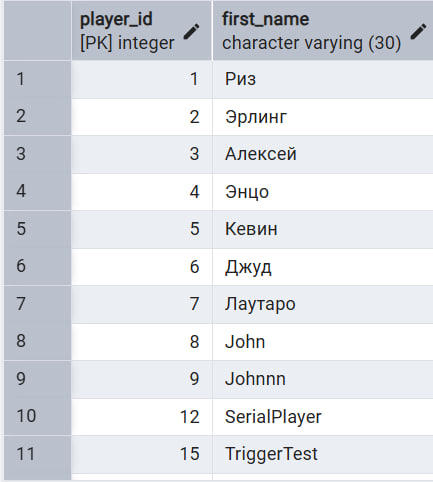

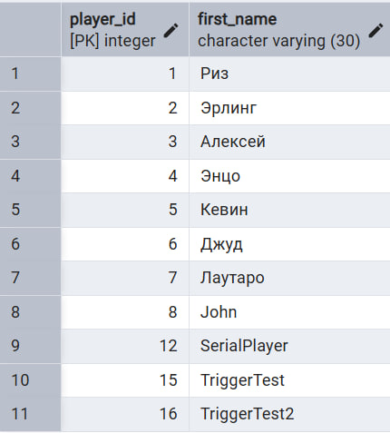


```sql
CREATE OR REPLACE FUNCTION football_club.trg_no_salary_decrease()
RETURNS TRIGGER AS $$
BEGIN
  IF NEW.salary < OLD.salary THEN
    RAISE EXCEPTION 'Salary cannot be decreased for staff %', NEW.staff_id;
  END IF;

  RETURN NEW;
END;
$$ LANGUAGE plpgsql;
CREATE TRIGGER trg_staff_no_salary_decrease
BEFORE UPDATE ON football_club.staff
FOR EACH ROW
EXECUTE FUNCTION football_club.trg_no_salary_decrease();
UPDATE football_club.staff
SET salary = salary - 1000::money
WHERE staff_id = 1;

```
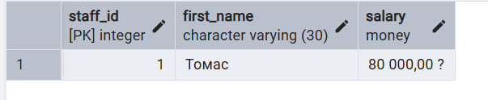
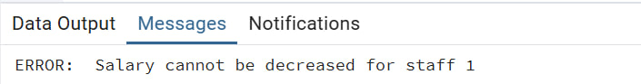


```sql
CREATE OR REPLACE FUNCTION football_club.trg_forbid_club_city_change()
RETURNS TRIGGER AS $$
BEGIN
  IF NEW.city_id IS DISTINCT FROM OLD.city_id THEN
    RAISE EXCEPTION 'City of club % cannot be changed', NEW.club_id;
  END IF;

  RETURN NEW;
END;
$$ LANGUAGE plpgsql;
CREATE TRIGGER trg_club_forbid_city_change
BEFORE UPDATE ON football_club.football_clubs
FOR EACH ROW
EXECUTE FUNCTION football_club.trg_forbid_club_city_change();
UPDATE football_club.football_clubs
SET city_id = 2
WHERE club_id = 1;


```
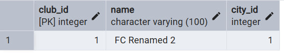
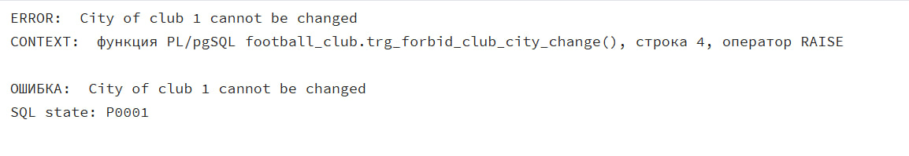


```sql
CREATE OR REPLACE FUNCTION football_club.trg_set_default_product_price()
RETURNS TRIGGER AS $$
BEGIN
  IF NEW.price IS NULL THEN
    NEW.price := 100::money;
  END IF;

  RETURN NEW;
END;
$$ LANGUAGE plpgsql;
CREATE TRIGGER trg_products_set_default_price
BEFORE INSERT ON football_club.products
FOR EACH ROW
EXECUTE FUNCTION football_club.trg_set_default_product_price();
INSERT INTO football_club.products(name, type, price, count, shop_id, height, width, length)
VALUES ('TrigNoPrice', 'Merch', NULL, 10, 1, 10, 10, 10);


```
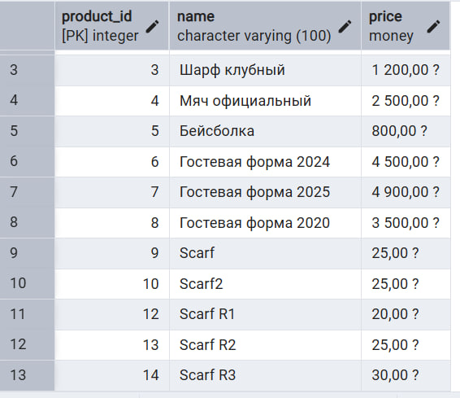
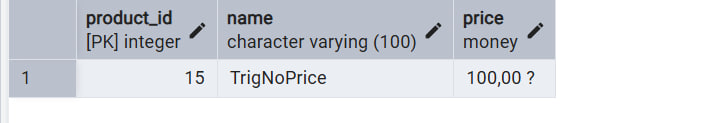


```sql
CREATE OR REPLACE FUNCTION football_club.trg_notice_new_player()
RETURNS TRIGGER AS $$
BEGIN
  RAISE NOTICE 'New player inserted: id=%, name=%',
               NEW.player_id, NEW.first_name;
  RETURN NEW;
END;
$$ LANGUAGE plpgsql;
CREATE TRIGGER trg_players_notice_after_insert
AFTER INSERT ON football_club.players
FOR EACH ROW
EXECUTE FUNCTION football_club.trg_notice_new_player();
INSERT INTO football_club.players(first_name, date_of_birth, nationality, position, market_value, club_id)
VALUES ('AfterTrigPlayer', '2000-01-01', 'Russia', 'Midfielder', 1000000, 1);


```
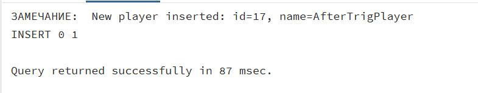
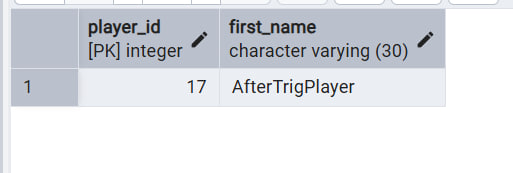


```sql
CREATE OR REPLACE FUNCTION football_club.trg_notice_player_value_change()
RETURNS TRIGGER AS $$
BEGIN
  IF NEW.market_value IS DISTINCT FROM OLD.market_value THEN
    RAISE NOTICE 'Player % value changed: % -> %',
                 NEW.player_id, OLD.market_value, NEW.market_value;
  END IF;

  RETURN NEW;
END;
$$ LANGUAGE plpgsql;
CREATE TRIGGER trg_players_notice_value_change
AFTER UPDATE ON football_club.players
FOR EACH ROW
EXECUTE FUNCTION football_club.trg_notice_player_value_change();
UPDATE football_club.players
SET market_value = market_value + 1000000::MONEY
WHERE player_id = 1;

```
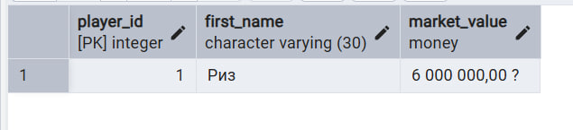
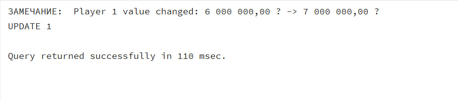
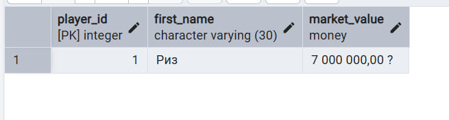


```sql
CREATE OR REPLACE FUNCTION football_club.trg_notice_club_stadium_change()
RETURNS TRIGGER AS $$
BEGIN
  IF NEW.stadium_id IS DISTINCT FROM OLD.stadium_id THEN
    RAISE NOTICE 'Club % changed stadium: % -> %',
                 NEW.club_id, OLD.stadium_id, NEW.stadium_id;
  END IF;

  RETURN NEW;
END;
$$ LANGUAGE plpgsql;
CREATE TRIGGER trg_club_notice_stadium_change
AFTER UPDATE ON football_club.football_clubs
FOR EACH ROW
EXECUTE FUNCTION football_club.trg_notice_club_stadium_change();
UPDATE football_club.football_clubs
SET stadium_id = 2
WHERE club_id = 1;

```
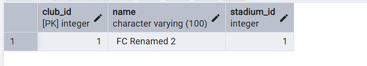
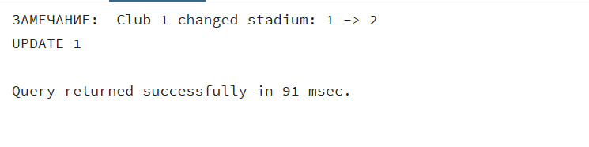


```sql
CREATE OR REPLACE FUNCTION football_club.trg_forbid_empty_player_name()
RETURNS TRIGGER AS $$
BEGIN
  IF NEW.first_name IS NULL OR NEW.first_name = '' THEN
    RAISE EXCEPTION 'Player name cannot be empty';
  END IF;

  RETURN NEW;
END;
$$ LANGUAGE plpgsql;
CREATE TRIGGER trg_players_forbid_empty_name
BEFORE INSERT ON football_club.players
FOR EACH ROW
EXECUTE FUNCTION football_club.trg_forbid_empty_player_name();
INSERT INTO football_club.players(first_name, date_of_birth, nationality, position, market_value, club_id)
VALUES (NULL, '2000-01-01', 'Russia', 'Midfielder', 1000000, 1);


```
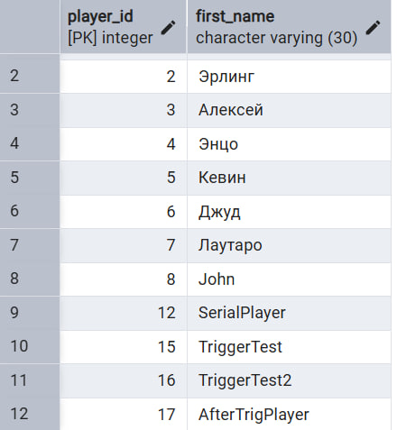
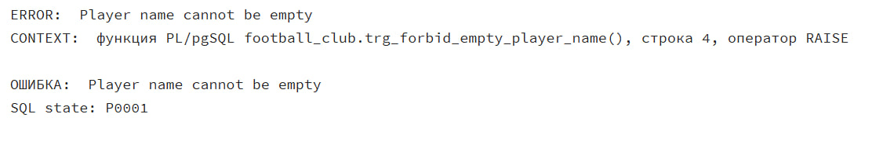


```sql
-- statement level :
-- 1 : добавляет спонсора для клуба, чей фан-шоп вставлен последним 
CREATE OR REPLACE FUNCTION trg_fun_shop_auto_sponsor() RETURNS trigger AS $$
DECLARE
    v_club_id INT;
BEGIN
    SELECT club_id INTO v_club_id
    FROM football_club.fun_shop
    ORDER BY shop_id DESC
    LIMIT 1;

    INSERT INTO football_club.sponsors (club_id, start_date, end_date, amount, type)
    VALUES (v_club_id, CURRENT_DATE, CURRENT_DATE + INTERVAL '1 year', 50000::money,
            'Авто-спонсор за новые фан-шопы');

    RETURN NULL; 
END;
$$ LANGUAGE plpgsql;

CREATE TRIGGER fun_shop_auto_sponsor
AFTER INSERT ON football_club.fun_shop
FOR EACH STATEMENT
EXECUTE FUNCTION trg_fun_shop_auto_sponsor();
```
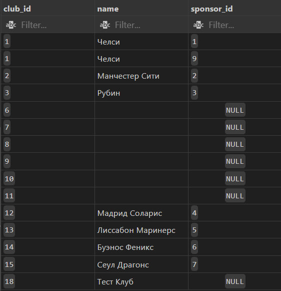
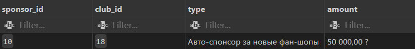
```sql
CREATE OR REPLACE FUNCTION trg_players_auto_contract() RETURNS trigger AS $$
DECLARE
    v_player_id INT;
BEGIN
    SELECT MAX(player_id) INTO v_player_id FROM football_club.players;

    INSERT INTO football_club.contracts (player_id, start_date, end_date, salary)
    VALUES (v_player_id, CURRENT_DATE, CURRENT_DATE + INTERVAL '1 year', 20000::money);

    RETURN NULL;
END;
$$ LANGUAGE plpgsql;

CREATE TRIGGER players_auto_contract
AFTER INSERT ON football_club.players
FOR EACH STATEMENT
EXECUTE FUNCTION trg_players_auto_contract();

INSERT INTO football_club.players(first_name, date_of_birth, nationality, position, market_value, club_id)
SELECT 'Демо Игрок', '2000-01-01', 'Россия', 'FW', 1000000::money, fc.club_id
FROM football_club.football_clubs fc
WHERE fc.name = 'Тест Клуб';
```

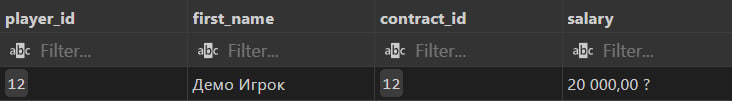

```sql

--не воркает на win
SELECT cron.schedule(
    'restock_monday',
    '0 23 * * *',
    $$
    UPDATE football_club.products
    SET count = count + 20
    WHERE count < 100;
    $$
);


SELECT cron.schedule(
    'increase_price',
    '0 23 * * *',
    $$
    UPDATE football_club.products
    SET price = price::numeric * 1.05
    WHERE count < 50;
    $$
);

SELECT cron.schedule(
    'lower_price',
    '0 23 * * *',
    $$
    UPDATE football_club.products
    SET price = price::numeric * 1.05
    WHERE count > 80;
    $$
);

SELECT *
FROM cron.job;

SELECT *
FROM cron.job_run_details;
```